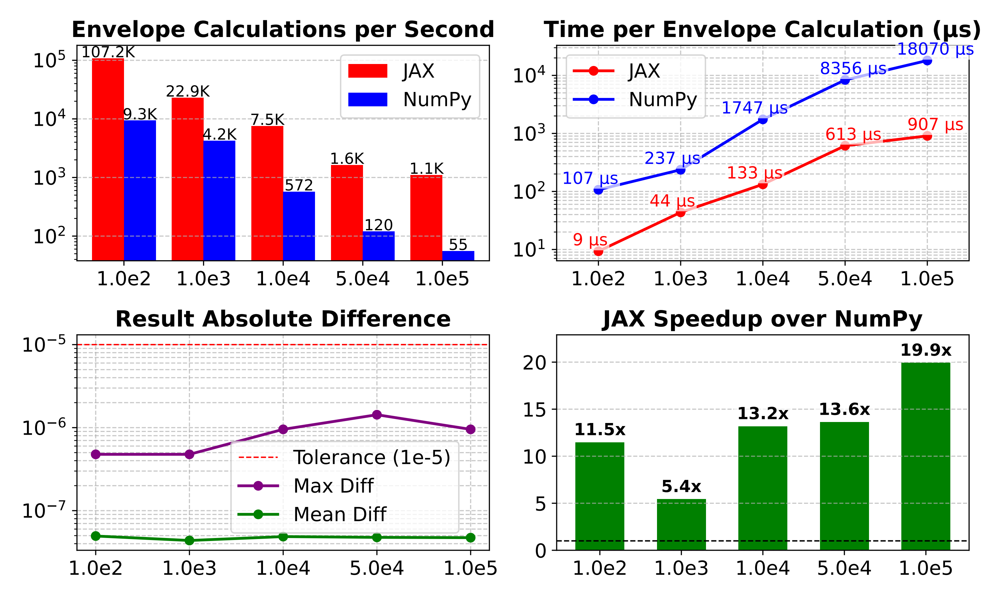
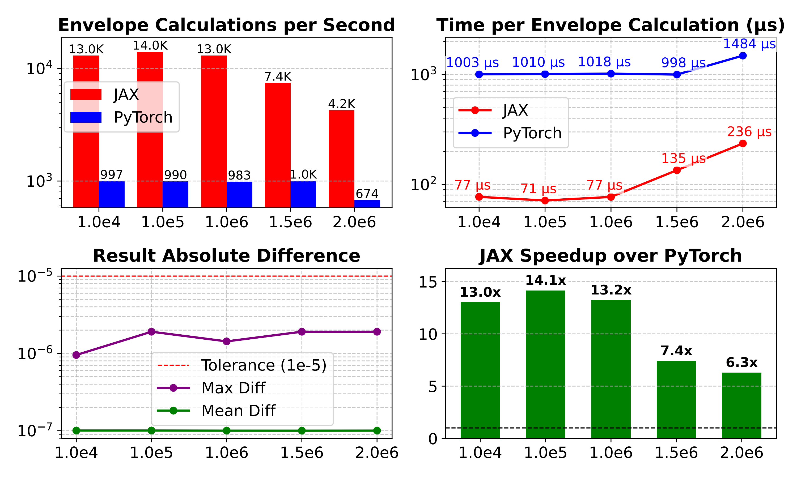

# High-Performance Temporal Interference Stimulation Envelope Solver Module based on JAX

This project provides a high-performance computing module based on the `JAX` framework for rapidly solving the envelope field distribution of Temporal Interference Stimulation (TIS).

Temporal interference technology generates a low-frequency envelope at the difference frequency by superimposing high-frequency currents, which is used to achieve non-invasive focused stimulation of deep brain regions. The calculation of the envelope field is a major computational bottleneck in TIS simulation and optimization, especially in fine models requiring the processing of a large number of voxels.

This module utilizes `JAX`'s optimization strategies such as `Just-In-Time (JIT)` compilation and vectorization to significantly improve the speed of envelope field calculation, and can be used to accelerate research work such as TIS-based neuromodulation simulation and parameter optimization.

## Related Research Paper

This code is the implementation of the high-performance computing module from the following research paper:

**"Multi-Channel Temporal Interference Retinal Stimulation Based on Reinforcement Learning"**
*Xiayu Chen, Wennan Chan, Yingqiang Meng, Runze Liu, Yueyi Yu, Sheng Hu, Jijun Han, Xiaoxiao Wang, Jiawei Zhou, Bensheng Qiu, Yanming Wang*
[Paper Link (e.g., arXiv or journal page)]

*If you use this code in your research, please cite our paper.*

## Features

*   **High Efficiency:** Based on JAX, significantly improves envelope field calculation speed through JIT compilation and hardware acceleration (CPU/GPU).
*   **Formula Implementation:** Implements the formula used in temporal interference stimulation to calculate the maximum value of the envelope field in any direction, suitable for processing electric field vectors.

$$
\begin{equation}
	\left| \vec{E}_{AM}(\vec{r}) \right| =
	\begin{cases}
		2 \left| \vec{E}_2(\vec{r}) \right|, \text{if } \left| \vec{E}_1(\vec{r}) \right| < \left| \vec{E}_2(\vec{r}) \right| \cos(\alpha) \\
		\quad                                                                                                                              \\
		\dfrac{2\left| \vec{E}_2(\vec{r}) \times ( \vec{E}_1(\vec{r}) - \vec{E}_2(\vec{r})) \right|}{\left| \vec{E}_1(\vec{r}) - \vec{E}_2(\vec{r}) \right|}, \text{otherwise}
	\end{cases}
\end{equation}
$$

Where $\alpha$ represents the angle between $\vec{E}_1(\vec{r})$ and $\vec{E}_2(\vec{r})$. This formula is valid only when $\alpha < \frac{\pi}{2}$ and $|\vec{E}_1(\vec{r})| > |\vec{E}_2(\vec{r})|$. Otherwise, $\vec{E}_2(\vec{r})$ needs to be reversed and swapped with $\vec{E}_1(\vec{r})$.
*   **Easy Integration:** Can be used as a standalone computation function, convenient for integration into other TIS simulation or optimization frameworks.

## Environment Requirements

*   Python 3.9+
*   JAX and JAXlib (Requires selecting the appropriate backend for installation based on your hardware, supports CPU and GPU acceleration)
*   NumPy

## Installation

1.  **Clone the repository**
    ```bash
    git clone https://github.com/ayakacxy/TIS_envelope.git
    cd TIS_envelope
    ```

2.  **Install dependencies**
    ```bash
    ### Create virtual environment
    conda create -n envelop_solve python=3.9

    # Install JAX (CPU version)
    pip install -U jax

    # If you have a CUDA GPU, it is recommended to install the GPU version for optimal performance
    # Please refer to the official JAX documentation to select the corresponding jaxlib version for your CUDA version
    # https://docs.jax.dev/en/latest/installation.html
    # Example (for CUDA 12):
    pip install -U "jax[cuda12]"
    ```
    *Please be sure to refer to the official JAX installation guide to ensure the installed JAXlib version is compatible with your CUDA version.*
    Also, it is currently tested that `torch==2.6.0` and `jax=0.6.0` are compatible under `cuda=12.2`. Although `jax`'s `cudnn` version is higher, running it concurrently with `torch` does not cause issues. **The GPU version of JAX currently cannot run on Windows, please refer to the official JAX documentation [JAX](https://docs.jax.dev/en/latest/) for details.**

## Usage

The core functionality of this module is a function that takes two electric field tensors as input and returns the corresponding envelope field magnitude tensor.

Assume your finite element model has $N$ voxels, and the electric field at each voxel is a 3D vector $(E_x, E_y, E_z)$. For two current frequencies, you will obtain two electric field tensors $E_1$ and $E_2$.

Input Format Requirements:
*   `E_1`: The electric field tensor generated by the first frequency, shape `(N, 3)` as a NumPy or JAX array.
*   `E_2`: The electric field tensor generated by the second frequency, shape `(N, 3)` as a NumPy or JAX array.

Function Call Example:
```python
import jax
import jax.numpy as jnp
import numpy as np
from env_jax import envelop_jax


N = 10
key = jax.random.PRNGKey(0)
E1_np = np.random.rand(N, 3) * 0.1  # Example NumPy array
E2_np = np.random.rand(N, 3) * 0.1

# Convert NumPy arrays to JAX arrays to enable JAX acceleration
E1_jax = jnp.array(E1_np)
E2_jax = jnp.array(E2_np)

# Solve for the interference envelope
envelope = envelop_jax(E1_jax, E2_jax)

print("E1 shape:", E1_jax.shape)
print("E2 shape:", E2_jax.shape)
print("Envelope shape:", envelope.shape) # Output shape should be (N,)
```

## Code Structure

```
.
├── env_jax.py                    # Core function file for solving the envelope field
├── Benchmark_cpu.py              # Performance comparison script between JAX and NumPy on CPU
├── Benchmark_cpu.py              # Performance comparison script between JAX and PyTorch on GPU
├── README.md                     # This file
├── test.py                       # Test file
├── numpy_jax_comparison.pdf      # Performance difference visualization plot on CPU
├── jax_pytorch_comparison.pdf    # Performance difference visualization plot on GPU
├── numpy_jax_comparison.png      # Performance difference visualization plot on CPU
├── jax_pytorch_comparison.png    # Performance difference visualization plot on GPU
└── LICENSE
```


## Performance 
The JAX-accelerated solver implemented in this module demonstrates significant performance advantages over implementations based on NumPy or PyTorch on both CPU and GPU, with computation speed increased by nearly an order of magnitude, especially suitable for large-scale voxel calculations.
### CPU Acceleration Performance



### GPU Acceleration Performance



## Contributing 

Contributions to this project are welcome! If you find bugs, have suggestions for improvement, or want to add new features, please feel free to submit a Pull Request.

## License 

This project is licensed under the MIT License - see the `LICENSE` file for details.

## Contact 

If you have any questions or wish to collaborate, please contact us via the following method:

*   Xiayu Chen [cxy20031013@mail.ustc.edu.cn]

## Acknowledgements 

Thanks to the developers of the `JAX` framework for providing powerful high-performance computing tools. The NumPy-based envelope calculation code is derived from [MOVEA](https://github.com/ncclabsustech/MOVEA)